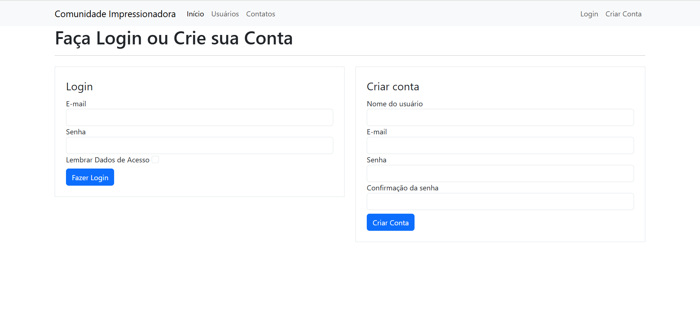
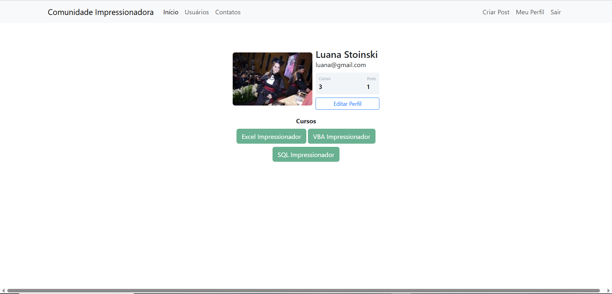
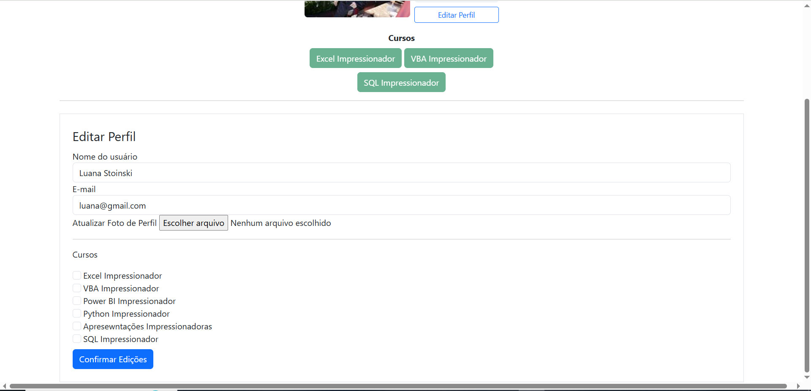
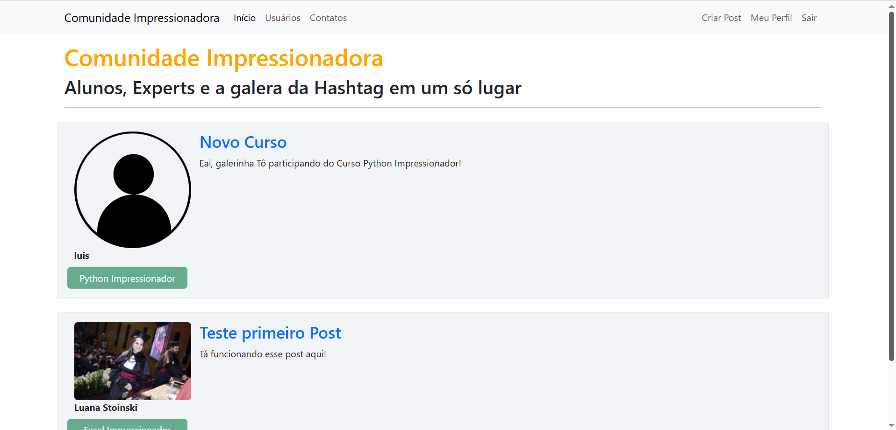
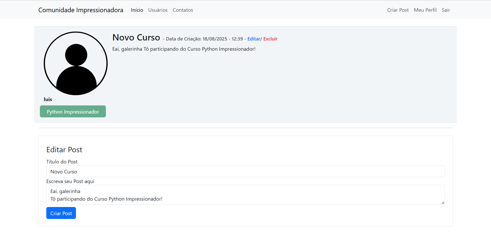
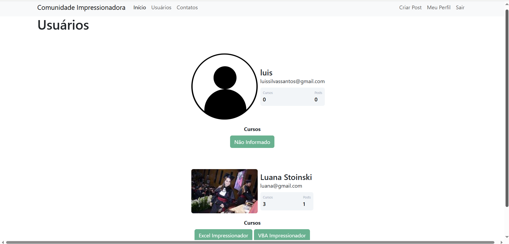

# Comunidade Impressionadora
Um sistema web em Flask para gerenciamento de usuários, autenticação, posts e perfis personalizados.  

## 📌 Sobre o Projeto
O **Comunidade Impressionadora** é uma aplicação web construída em Flask que permite:
- Criar e gerenciar usuários com autenticação (login e logout).
- Editar perfis com upload de foto e cursos concluídos.
- Criar, visualizar, editar e excluir posts.
- Visualizar todos os usuários da comunidade.

A aplicação foi desenvolvida com foco em aprendizado e prática de **Flask, SQLAlchemy, autenticação com Flask-Login e PostgreSQL/SQLite**.

## ⚙️ Lógica de Desenvolvimento

A aplicação segue uma estrutura modular:  

### `__init__.py`
- Cria e configura o app Flask.  
- Define a conexão com o banco (variável `DATABASE_URL` para produção ou SQLite como fallback).  
- Inicializa extensões como **SQLAlchemy**, **Bcrypt** e **LoginManager**.  
- Garante a criação automática das tabelas caso não existam.  

### `models.py`
- Contém as classes **Usuario** e **Post**, mapeadas como tabelas no banco via SQLAlchemy.  
- Relacionamento **1:N** (um usuário pode ter vários posts).  
- Métodos auxiliares como `contar_posts()` para facilitar consultas.  

### `forms.py`
- Implementa formulários com validações robustas (email único, confirmação de senha, campos obrigatórios).  
- Usa **Flask-WTF** e **WTForms** para simplificar validações e **CSRF protection**.  

### `routes.py`
- Define as rotas principais da aplicação (home, login, perfil, criar post, editar perfil, etc.).  
- Utiliza **decorators de autenticação** (`@login_required`) para proteger rotas restritas.  
- Inclui funções auxiliares como:  
  - `salvar_imagem()`: redimensiona e salva fotos de perfil em `static/fotos_perfil/`.  
  - `atualizar_cursos()`: processa checkboxes de cursos selecionados no perfil.  

---

## ✅ Funcionalidades
- [x] Criar conta e login de usuários
- [x] Autenticação com Flask-Login
- [x] Upload e atualização de foto de perfil
- [x] Criar, editar e excluir posts
- [x] Listagem de usuários
- [ ] Área de administração (em breve)

## 🖼️ Demonstração
### Tela de Login

### Perfil do Usuário

### Feed de Posts

### Listagem de Usuários

## 🛠 Tecnologias
- [Python 3.12](https://www.python.org/)
- [Flask 3.1.1](https://flask.palletsprojects.com/)
- [Flask-Login](https://flask-login.readthedocs.io/)
- [Flask-WTF](https://flask-wtf.readthedocs.io/)
- [SQLAlchemy](https://www.sqlalchemy.org/)
- [PostgreSQL](https://www.postgresql.org/) (produção) / SQLite (desenvolvimento)
- [Gunicorn](https://gunicorn.org/) (deploy)

## 🌐 Deploy
A aplicação está disponível em produção no [Railway](https://railway.app/).

